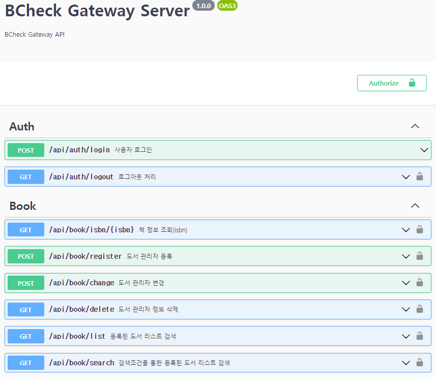

### BCheck Gateway Application 

### BCheck Gateway Application 특징 
- <b>TypeDI</b> Dependency Injection for TypeScript.
  https://github.com/typestack/typedi
- <b>TypeORM</b> help you to develop any kind of application that uses databases
  https://typeorm.io/#/
- <b>JWT</b> JWT security strategy using AccessToken
- <b>Swagger</b> OpenAPI endpoint documentation.
  class-validator-jsonschema, class-transformer  
- <b>AWS DocumentDB</b> using mongodb
- <b>morgan</b> Create a new morgan logger middleware function using the given format and options
  https://www.npmjs.com/package/morgan
- <b>winston, winston-daily-rotate-file</b> logger print console/file.
  https://github.com/winstonjs/winston
- <b>cross-env</b> Run scripts that set and use environment variables across platforms
- <b>Docker</b> provides a Dockerfile

### Controller, Service annotation 정의 
API의 결과값을 JSON 포멧으로 리턴하므로 @JsonController를 선언한다.  
- Controller 정의
```text
@JsonController("/book")
export class BookController {

  constructor(private bookService: BookService) {}
```
- Service 정의 
서비스 클래스의 경우 @Service()를 선언으로 시작한다. 데이터베이스 조작이 필요하다면 Repository 클래스를 만들고   
@InjectRepository를 생성자로 정의해서 사용한다.    
```text
@Service()
export class BookService {

    constructor(
      @InjectRepository() private userRepository: UserRepository,
```
### Swagger 문서 정의하기 

- Post 방식의 파라미터 정의   
  Controller 선언부에 @OpenAPI선언   
  requestBody 선언부에 content를 선언하고 프로퍼티 정의한다.  
```text
  @OpenAPI({
    summary: "사용자 로그인",
    statusCode: "200",
    responses: {
      "401": {
        description: "Unauthorized",
      },
    },
    requestBody: {
      content: {
        "application/x-www-form-urlencoded": {
          schema: {
            type: "object",
            properties: {
              "id": {
                description: "User ID",
                example: "mjoung@hist.co.kr",
                type: "string"
              },
              "passwd": {
                description: "User Password",
                example: "mjoung@hist.co.kr",
                type: "string"
              }
            },
            required: ["id", "passwd"]
          }
        }
      }
    }
  })
```
 
- 쿼리 파라미터 정의
```text
  @OpenAPI({
    summary: "도서 관리자 정보 삭제",
    statusCode: "200",
    responses: {
      "401": {
        description: "Unauthorized",
      },
    },
    security: [{ bearerAuth: [] }],
    parameters: [
      {
        "in": "query",
        "name": "id",
        "required": true,
        "description": "관리자ID",
        "schema": {
          "type": "string",
          "example": "mjoung@hist.co.kr"
        }
      },
      {
        "in": "query",
        "name": "del_type",
        "required": true,
        "description": "삭제사유",
        "schema": {
          "type": "string",
          "example": "1"
        }
      },
      {
        "in": "query",
        "name": "del_content",
        "required": false,
        "description": "기타사유설명",
        "schema": {
          "type": "string",
          "example": ""
        }
      }
    ]
  })
```

### Module installation
- Type Script add
```shell
 $ npm install typescript --save
 $ npm install @types/node --save
```
- 타입스크립트 옵션은 tsconfig.json을 이용해서 초기화 및 설정
```shell
 $ npx tsc --init --rootDir app --outDir lib --esModuleInterop --resolveJsonModule --lib es6,dom --module commonjs
```
- 실시간 컴파일 지원 모듈 추가
```shell
 $ npm install ts-node --save 
```
- nodemon 설치를 통한 변경 파일 적용
```shell
 $npm install nodemon --save
```
- package.json에서 script 지정 : 기본 진입 파일 지정
```json
   "scripts": {
     "start": "npm run build:live",
     "build": "tsc -p .",
     "build:live": "nodemon --watch 'app/**/*.ts' --exec \"ts-node\" app/index.ts",
     "test": "echo \"Error: no test specified\" && exit 1"
   },
```
- TypeORM, TypeDI 설치 
```shell
 $ npm install typeorm --save
 $ npm install reflect-metadata --save 
```
- DocumentDB (mongodb) 설치
```shell
 $ npm install mongodb@^3.6.0 --save
```
- TypeScript configuration  
 make sure you are using TypeScript version 3.3 or higher, and you have enabled the following settings in tsconfig.json.
```json
  "emitDecoratorMetadata": true,
  "experimentalDecorators": true,
```
- bcrypt, express, body-parser, cors, typedi, routing-controllers, morgan
```shell
 $ npm install bcrypt --save
 $ npm install express --save
 $ npm install @types/express --save-dev
 $ npm install body-parser --save 
 $ npm install @types/body-parser --save-dev
 $ npm install cors --save 
 $ npm install typedi --save
 $ npm install routing-controllers --save
 $ npm install @types/morgan --save-dev
 $ npm install morgan --save
```
- jsonwebtoken
- swagger-ui-express, class-validator, routing-controllers-openapi, class-validator-jsonschema, class-transformer
```shell
 $ npm i --save-dev @types/swagger-ui-express
 $ npm i --save class-validator
 $ npm i --save routing-controllers-openapi
 $ npm i --save class-validator-jsonschema
```
- winstom, winston-daily-rotate-file
```shell
 $ npm i --save winstom
 $ npm i --save winston-daily-rotate-file
```
- sentry
```shell
 $ npm i --save-dev @sentry/node
```
- cross-env  
  Run scripts that set and use environment variables across platforms
```shell
 $ npm install --save-dev cross-env
```
- dotenv
```shell
 $ npm install dotenv --save 
```
- eslint
  ESLint는 JavaScript, JSX의 정적 분석 도구로 오픈 소스 프로젝트  
```shell
 $ npm install eslint --save
 $ npm install eslint-config-prettier --save
 $ npm install eslint-plugin-prettier --save
```
- jest
```shell
 $ npm install jest --save
```
- prettier, ts-jest, ts-node, supertest, husky
```shell
 $ npm install prettier --save-dev
 $ npm install ts-jest --save-dev
 $ npm install ts-node --save-dev
 $ npm install supertest --save-dev
 $ npm install husky --save-dev
```
- ts-node

- request-promise-native
 외부 Request 호출하기 위한 라이브러리  
```shell
 $ npm install request-promise-native --save
```

- husky
package.json에 추가한다.
```json
  "husky": {
    "hooks": {
      "pre-commit": "yarn lint --fix",
      "pre-push": "yarn test"
    }
  },
```
